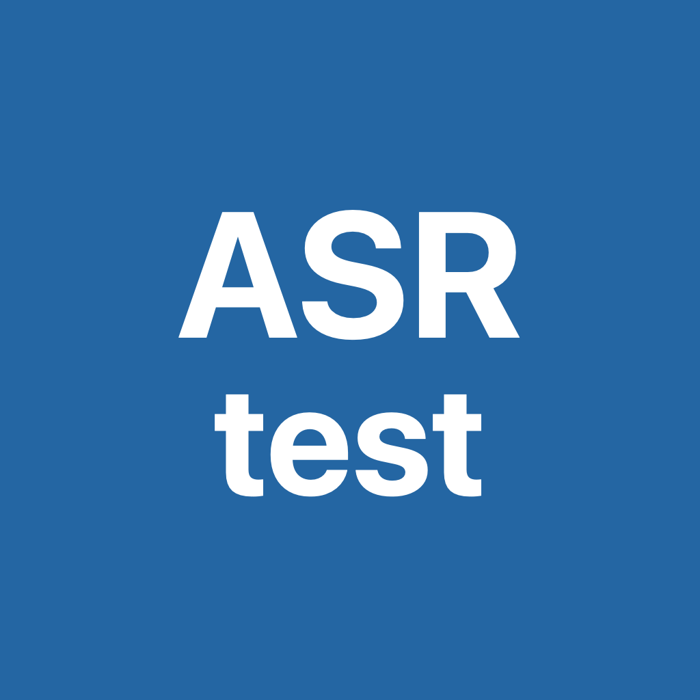
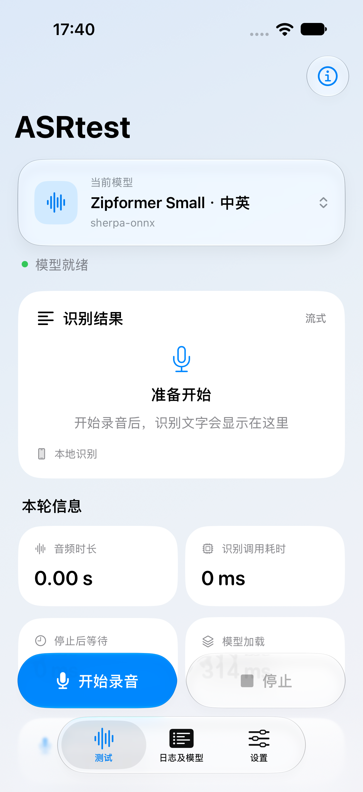
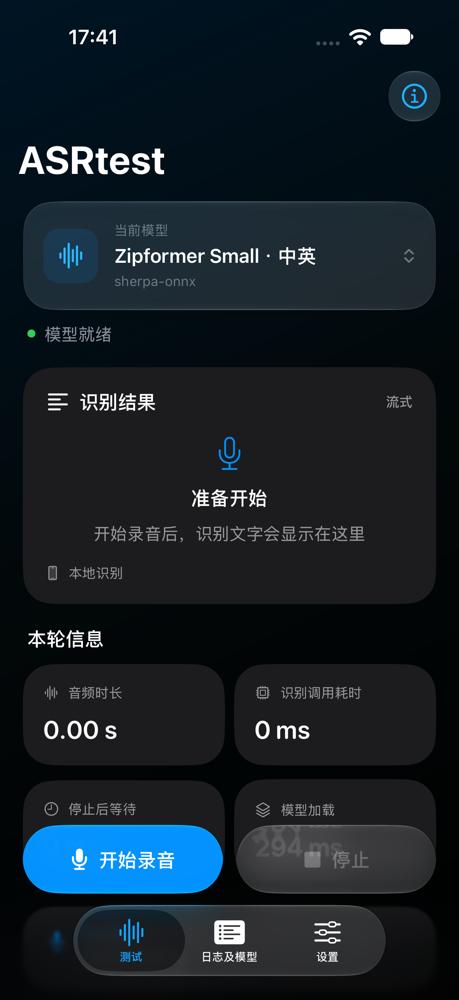
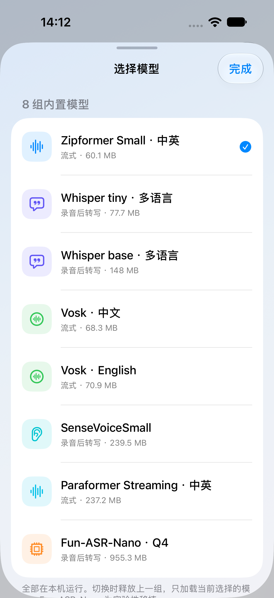
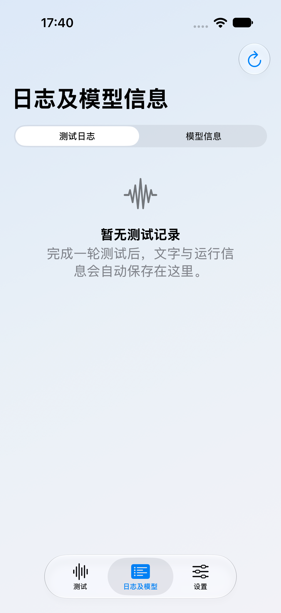
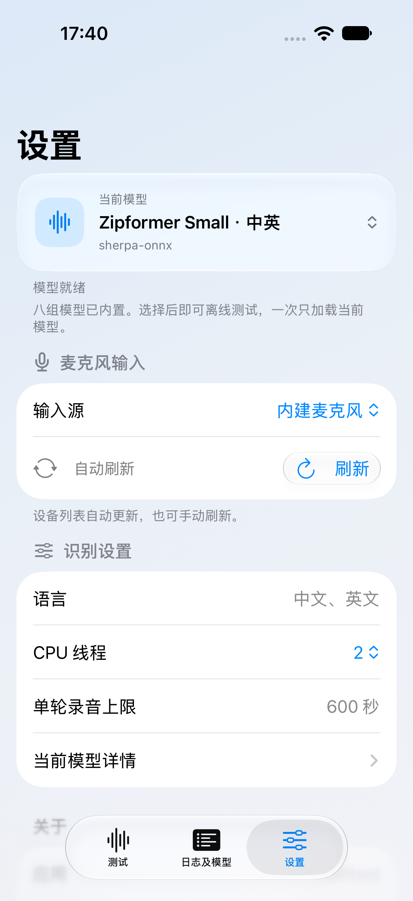
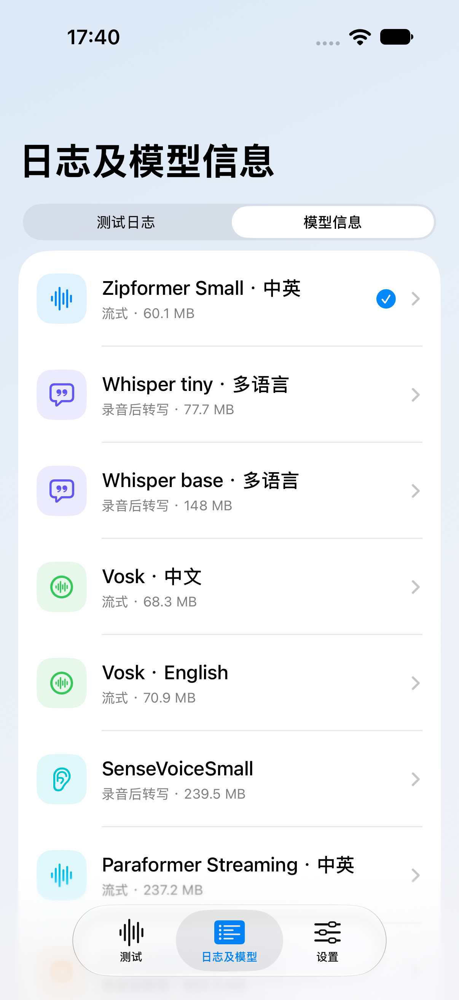

<div align="center">



# ASRtest

### iPhone、iPad 与 Apple Watch 的离线语音识别模型测试工具

[](ASRtest.xcodeproj/project.pbxproj)
[](#1-打开与运行)
[](#apple-watch-本地运行库与许可)
[](#3-已接入模型)
[](#离线测试)
[](LICENSE)

[项目速览](#项目速览) · [界面预览](#界面预览) · [打开与运行](#1-打开与运行) · [已接入模型](#3-已接入模型) · [测试记录](#5-测试记录与指标) · [验证与边界](#7-已完成的验证与边界) · [常见问题](#8-常见问题)

</div>

ASRtest 2.0.0 是一个完全本地运行的 iOS ASR 模型测试工具，由原 ASRtest1IOS、ASRtest2IOS、ASRtest3IOS 整合而来。iPhone/iPad 端八组模型及必要运行库全部随 App 打包，使用同一套录音、模型切换和测试记录界面。首次安装后即可离线切换使用，无需另行获取模型。配套 Watch App 只包含 Whisper tiny，不使用 iPhone 代算。识别过程中不上传音频，不包含云端 ASR、聊天或摘要功能。
工程入口为 `ASRtest.xcodeproj`；iOS Scheme 为 `ASRtest`，Watch Scheme 为 `ASRtestWatch`。最低系统版本为 iOS 17.0 和 watchOS 10.0。iOS 支持 arm64 iPhone/iPad 及 Apple Silicon Mac 的 arm64 Simulator；现有依赖不支持 Intel Mac 的 x86_64 Simulator。真机安装需在 Xcode 中配置自己的开发团队与 Bundle Identifier，且 iPhone App 与 Watch App 均需满足签名要求。

## 项目速览

| 项目 | 当前工程 |
|---|---|
| 应用版本 | `2.0.0` |
| iPhone / iPad | 八组随 App 打包的本地 ASR 模型；支持录音、单文件与批量 WAV 测试 |
| Apple Watch | 手表本地运行 Whisper tiny，提供向配对 iPhone 传输日志的流程 |
| 数据处理 | 音频与推理保留在设备上；日志可在 App 内查看和导出 |
| 工程与许可 | `ASRtest.xcodeproj`；项目源码采用 [Apache-2.0](LICENSE)，第三方材料见 [署名与许可清单](THIRD_PARTY_NOTICES.md) |

## 界面预览

<table>
  <tr>
    <td align="center"><br><sub>测试页 · 浅色</sub></td>
    <td align="center"><br><sub>测试页 · 深色</sub></td>
    <td align="center"><br><sub>模型选择</sub></td>
  </tr>
  <tr>
    <td align="center"><br><sub>日志与模型信息</sub></td>
    <td align="center"><br><sub>设置</sub></td>
    <td align="center"><br><sub>模型信息</sub></td>
  </tr>
</table>

以上截图由 `ASRtestUISmoke` 在 iPhone 18 Pro、iOS 27.0 模拟器中从当前源码自动生成；用于展示界面与导航，不代表真机识别准确率、耗时、内存或温升。

## 1. 打开与运行

克隆仓库前安装 Git LFS，克隆后执行 `git lfs pull`，确保 `ModelLibrary/` 中的权重和 `Packages/` 中的运行库已下载为真实文件。若只看到 LFS 指针文件，模型校验和构建会失败。

1. 用 Xcode 打开仓库根目录的 `ASRtest.xcodeproj`，等待 Swift Package Manager 完成依赖解析。第一次解析官方 sherpa/ONNX Runtime 包需要网络。
2. 选择 `ASRtest` target，检查 Signing & Capabilities。将开发团队与 Bundle Identifier 设置为自己的签名配置；App 版本号为 `2.0.0`。
3. 通过 USB 连接自己的 iPhone，完成信任与开发者模式设置，选择该设备后 Run。也可选择 Apple Silicon 上的 iOS Simulator 检查界面和文件推理流程。
4. 首次启动默认加载 Zipformer Small。允许麦克风访问后，在“测试”页开始和停止录音；在“设置”中可直接切换其余七组内置模型。

本工程已经完成 iOS device 与 Simulator 构建，以及模拟器中的本地模型文件推理回归；尚未用用户的 iPhone 实测麦克风采集、输入设备切换、耗电、发热和运行内存。Simulator 上的识别时间不能作为手机性能结论。

## 2. 三个页面
界面采用系统原生 Tab Bar、导航栏与模型选择面板；支持液态玻璃的系统使用原生玻璃模型按钮、录音按钮和工具按钮。识别文字、日志和指标保持实底以保证阅读；浅色、深色与减少透明度设置分别适配，旧系统使用系统卡片及标准按钮。首页点击当前模型卡片，也可直接切换八组内置模型。

| 页面 | 功能 |
|---|---|
| 测试 | 单次录音与逐文件 WAV 批量测试；显示流式中间文字或非流式最终文字、进度、耗时及输入源。同一批文件可切换模型再测一轮。iPad 宽屏显示左侧控制、右侧结果；窄屏单列。 |
| 日志及模型信息 | 浏览单次、批量组与已入库的 Watch 日志；查看每个文件完整转写、状态和耗时；安全删除、清空、导出全部日志 ZIP；查看模型来源和文件。 |
| 设置 | 切换模型、麦克风输入源和支持的语言选项；设置适用模型的 CPU 线程数、SenseVoice ITN；查看内置模型状态和 App 版本。 |

八组权重都在 App Bundle，但一次只加载一个模型。模型切换前会释放当前识别器，直接读取当前 Bundle 中的新模型，通过文件校验后再加载。录音和处理期间限制修改模型与识别选项，避免一条记录混入两套配置。输入源保留手动刷新按钮，并在进入前台、音频路由变化及相关会话状态变化时自动刷新；记录中保存实际使用的输入设备。
流式模型在录音期间输出中间结果，结束时完成尾部处理。Whisper、SenseVoice 和 Nano 在停止后进行转写，不生成伪流式结果。本工具的流式录音上限为每轮 600 秒，非流式为每轮 30 秒；这是当前测试 App 的限制，不是模型能力上限。

### 批量 WAV 测试

在测试页选择最多 100 个 WAV。选中文件会复制到 App 临时目录，用于当前会话中切换模型重测；每轮开始时固定模型、语言、线程和 ITN 设置。文件按顺序打开、按块解码，不会一次把整批 PCM 放入内存。无法导入、格式不支持或超过所选模型单轮时长上限的文件标记失败，后续文件继续处理；“停止批量测试”会结束当前文件并跳过余项。每轮产生独立批量组，每个成功进入识别器的文件保留自己的完整 JSON/JSONL，会话 JSON 中含批次与文件关联。原始音频不写入日志，也不进入 ZIP。文件临时副本在选用新批次后移除；如需跨 App 重启重测，请重新选择原文件。

## 3. 已接入模型

以下大小是对应配置全部必要模型文件的十进制 MB，不是 App 安装体积或运行内存。所有八组均已完成原生接入及本地样例推理，权重全部内置；切换时等待校验和加载完成即可。

| 模型 | 本地推理框架 | 语言及识别方式 | 文件大小 | ModelLibrary 目录 |
|---|---|---|---:|---|
| Zipformer Small | sherpa-onnx | 中英，原生流式；2023-02-16 / chunk 32 | 60.14 MB | `zipformer` |
| Whisper tiny multilingual | whisper.cpp | 多语言，录音后转写；当前 UI 提供自动/中文/英文 | 77.69 MB | `whisperTiny` |
| Whisper base multilingual | whisper.cpp | 多语言，录音后转写；当前 UI 提供自动/中文/英文 | 147.95 MB | `whisperBase` |
| Vosk small-cn-0.22 | Vosk | 中文，原生流式 | 68.29 MB | `voskChinese` |
| Vosk small-en-us-0.15 | Vosk | 英文，原生流式 | 70.90 MB | `voskEnglish` |
| SenseVoiceSmall INT8 | sherpa-onnx Offline API | 中、英、粤、日、韩；录音后转写，可选语言和 ITN | 239.55 MB | `senseVoice` |
| Paraformer Streaming INT8 | sherpa-onnx Online API | 中英，原生流式 | 237.20 MB | `paraformer` |
| Fun-ASR-Nano Q4 | 原生 Fun-ASR / llama.cpp / GGML | 中、英、日；停止后本地 VAD 分段与转写，实验性移植 | 955.27 MB | `nano` |

Nano 使用官方配套的音频 encoder/adaptor、ASR 解码器和 FSMN-VAD，全部在本机运行。当前一轮最多 30 秒，停止后按 VAD 和有界窗口处理，不在录音期间显示实时文字。原生实现采用 CPU，运行内存、温升与长时间稳定性仍需在目标 iPhone 上验证。
模型与项目来源：

- sherpa-onnx：https://github.com/k2-fsa/sherpa-onnx
- whisper.cpp：https://github.com/ggml-org/whisper.cpp
- Vosk：https://github.com/alphacep/vosk-api
- SenseVoice：https://github.com/QwenAudio/SenseVoice
- FunASR / Paraformer：https://github.com/modelscope/FunASR
- Fun-ASR / Nano：https://github.com/QwenAudio/Fun-ASR

## 4. 全部模型随 App 打包

八组模型文件合计 **1,857,000,819 字节，约 1.857 GB**，均来自工程根目录的 `ModelLibrary`，作为完整文件夹资源打进 App Bundle。安装体积还包含程序、运行库和其他资源，实际以 Xcode 与设备显示为准。
运行时直接读取 `ASRtest.app/ModelLibrary/<模型ID>`。这些是只读的内置资源，App 不会再建立另一套可替换的模型目录，也不读取旧版本的导入副本。更换权重版本需更新工程资源与清单后重新构建；日常测试只需在设置中切换模型。

```text
ModelLibrary/
  zipformer/       encoder-epoch-99-avg-1.int8.onnx
                   decoder-epoch-99-avg-1.onnx
                   joiner-epoch-99-avg-1.int8.onnx、tokens.txt
  whisperTiny/     ggml-tiny.bin
  whisperBase/     ggml-base.bin
  voskChinese/     am/、conf/、graph/、ivector/、README
  voskEnglish/     am/、conf/、graph/、ivector/、README
  senseVoice/      model.int8.onnx、tokens.txt
  paraformer/      encoder.int8.onnx、decoder.int8.onnx、tokens.txt
  nano/            funasr-encoder-f16.gguf
                   qwen3-0.6b-q4km.gguf、fsmn-vad.gguf
```

Vosk 中文与英文各保留 14 个必要文件及原有子目录结构；Nano 同时包含 encoder/adaptor、配套 ASR 解码器和 FSMN-VAD 三个 GGUF。
根目录 `ModelsManifest.json` 与 App 资源中的 `ASRtest/ModelsManifest.json` 记录每个文件的固定版本、字节数和 SHA256。模型读取校验失败时会显示具体错误，不回退到服务器推理。电脑端维护资源时可运行：

```sh
python3 Scripts/prepare-models.py --verify-only
```

该命令仅检查现有工程文件。日常安装与测试不需要执行模型准备脚本。更新源码或清单后，应重新构建并核对实际 App Bundle 中的文件，不能只检查电脑端的 `ModelLibrary`。

### 离线测试

安装本 App 后关闭 Wi-Fi 与移动数据，完全结束应用再重新打开，在设置中依次切换所需内置模型即可测试离线加载与识别。模型、日志和音频处理都保留在本机。首次 Xcode 解析运行库依赖或个人开发签名所需的网络条件，与 App 安装后的 ASR 离线能力分别看待。

## 5. 测试记录与指标

记录保存在 App 的 `Documents/Sessions`，可在“日志及模型信息”中单条导出或生成全部日志 ZIP。

- `<会话ID>.json`：模型、框架、文件版本与哈希、语言和线程设置、设备与实际输入源、最终文字、音频时长、调用耗时、停止后等待、状态与错误。
- `<会话ID>.jsonl`：本轮配置、结果变化和结束事件等详细日志。
- `BatchGroups/<批次ID>.json`：本轮固定配置、逐文件状态及会话 ID 关联。旧版没有 `batch` 字段的会话 JSON 继续可读。
- `Documents/WatchLogs/<日志ID>.json`：手表经 WatchConnectivity 传送且 iPhone 成功写入后保存的日志；手表原件仍保留在手表上。

原始麦克风音频只在内存中用于识别，不写入录音文件。删除一条记录会同时删除该会话的 JSON 和 JSONL。打开日志列表时，损坏、版本不支持或标识不匹配的记录会被跳过，不影响其他记录。
批量组删除会同时删除组内会话；清空日志只处理 Sessions 与 WatchLogs，不删除模型。删除和 ZIP 导出在串行日志队列中执行，操作期间禁用新的识别和删除。ZIP 原样保留 JSON、JSONL、批量组及已入库手表日志，不包含模型或原始音频。
“识别调用耗时”统计边界保留在记录的 `metricDefinition`：流式包含接收、解码、取结果和结束调用；非流式统计结束转写调用，均不包含录音等待、重采样、界面或日志写入。不要直接把它当作不同架构之间严格可比的模型 RTF。“停止后等待”反映本轮结束后的实际等待体验；模型加载时间另记。

## 6. 运行库结构与固定版本

`NativeASREngine` 统一模型加载、会话开始、音频接收、结束、卸载接口；具体后端保留自身流式状态和结束方式。`RecognitionBackend` 负责音频转换、结果汇总与记录，`ASRController` 管理录音和界面状态。识别器及音频会话的主要操作在串行后台工作队列执行。

| 依赖 | 工程中的方式 | 固定版本/来源 |
|---|---|---|
| sherpa-onnx | 官方 SPM `sherpa-onnx-shared` | 1.13.8；commit `11afbd009a7f8c08f4bcf2fc1b265d0df4670fbf` |
| ONNX Runtime | sherpa 传递依赖的 shared iOS 产品 | 1.28.2；commit `8ebc5ebf92190903c274a7621ba4c96a732335ec` |
| whisper.cpp | `Packages/WhisperRuntime` 本地 XCFramework | 1.9.4；commit `927cfce34f31707e17f2bff35c349632fb9e2c3a`，复用 ASRtest2IOS 的 CPU + Accelerate 构建 |
| Vosk | `Packages/VoskRuntime` 本地 XCFramework | 复用 ASRtest3IOS；来自 `riderodd/react-native-vosk` commit `970d3d5e49225a1ebc24decbfd2d9317a02e7660`，Vosk 核心版本未知 |
| Nano | `Packages/NanoRuntime` 动态 XCFramework | Fun-ASR commit `0339018ba74a7defa3b6b6a96718d17b816be77b`；llama.cpp commit `8086439a4cea94c71a5dfb8fe4ad1546aebd640f` |

静态 sherpa 与静态 Vosk 实际产生了 OpenFst 重复符号，因此最终采用官方 shared sherpa/ORT。Nano 的 llama/GGML 内部符号封装在独立动态框架中，只导出 `asr_nano_*` C 接口，避免与 Whisper 的 GGML 混用。Xcode 构建时需保留 SPM 管理的动态框架嵌入与签名。
模型来源的固定 revision、逐文件 URL、大小和 SHA256 记录在 `ModelsManifest.json`。Whisper 和 Vosk 的现有二进制可直接使用；本统一工程没有新增这两套框架的重编脚本，Vosk 社区二进制也不能据此推定为某个官方核心版本。
Nano 已提供可重复构建脚本，需要 Xcode、Python 3、CMake：

```sh
python3 Scripts/build-nano.py
```

该脚本检查固定 Vendor revision，调用 `Scripts/prepare-nano-source.py` 生成本地 C 接口实现，并构建 arm64 iPhone 与 arm64 Simulator XCFramework。加 `--macos` 会额外生成供原生测试使用的 macOS 框架；该 macOS 产物不打进 iOS App。Nano 更详细的移植差异见 `Packages/NanoRuntime/README.md`。

### Apple Watch 本地运行库与许可

现有 sherpa-onnx 与 ONNX Runtime XCFramework 只含 iOS 架构，不能直接链接 watchOS。若要让 Zipformer Small 在手表运行，需要另行构建并验证 watchOS 版 sherpa-onnx/ONNX Runtime；本次没有把它标为可用。Watch App 选择重新构建 `whisper.cpp` 的通用 CPU 路径，只打包 Whisper tiny 多语言模型。它是非流式模型：录音期间显示状态，停止后才产生最终转写。由于尚未在实体手表完成本地推理验证，Whisper tiny 也标为“尚未真机验证”，仅 Debug 构建提供明确标注的实验录音入口；Release 构建禁用录音。其余七组在 Watch 端标为不可用。

Watch 运行库源码为 `Vendor/whisper.cpp` 固定 commit `927cfce34f31707e17f2bff35c349632fb9e2c3a`，MIT 许可见 `Vendor/whisper.cpp/LICENSE` 和 `WatchWhisperRuntime/WHISPER_LICENSE.txt`。`WatchWhisperRuntime/WatchWhisper.xcframework` 含 watchOS 设备 arm64/arm64_32 与模拟器 arm64/x86_64 静态库；可通过 `WatchWhisperRuntime/build.sh` 从仓库内源码重建。CPU、无 Metal/Accelerate，具体构建参数见 `WatchWhisperRuntime/README.md`。Watch 模型复用 `ModelLibrary/whisperTiny/ggml-tiny.bin`，来源为 `ModelsManifest.json` 固定的 Hugging Face revision `5359861c739e955e79d9a303bcbc70fb988958b1`，SHA256 为 `be07e048e1e599ad46341c8d2a135645097a538221678b7acdd1b1919c6e1b21`；[模型仓库页面](https://huggingface.co/ggerganov/whisper.cpp) 标注 MIT。Watch App 构建产物中只有这一份 77,691,713 字节的模型，没有把八组约 1.857 GB 权重复制到手表。

手表界面有左右滑动的模型、转写、日志、设置四页。日志先写手表本地；用户点击导出后区分“已排队”“已传送，待 iPhone 确认”“iPhone 已接收”。只有 iPhone 成功写入日志并回传确认后，日志才在 iOS“查看 Apple Watch 上的日志”中显示。由于 Whisper tiny 非流式，`partials` 为空是正常现象，不应理解为实时识别。

## 7. 已完成的验证与边界

验证日期：2026-09-20。下列文件保留实际输出；识别文本中出现错误也原样保留，不将“程序完成推理”解释为“识别准确”。

| 验证 | 证据 |
|---|---|
| 全模型内置 App 的 iOS device、arm64 Simulator 构建成功 | `Tests/app-device-build.log`、`Tests/UITests/last-run.json` 中本轮目录的 `build.log` |
| 原生三页导航、八组模型入口、浅色与深色界面；通过界面切换 Whisper tiny 与 Zipformer 并完成加载 | `Tests/UITests/last-run.json`、`Preview/ui-test-light.png`、`Preview/ui-test-dark.png` |
| 两份实际 App Bundle 均包含八组、42 个模型文件，合计 1,857,000,819 字节，逐文件 SHA256 全部正确 | `Tests/bundled-models-verification.json` |
| 三套原有运行库同进程创建、释放；静态冲突及 shared 解决 | `Tests/runtime-static-link.log`、`Tests/runtime-shared-device.log`、`Tests/runtime-shared-simulator.log`、`Tests/runtime-integration.md` |
| 七组标准后端的重复识别、空输入、取消后复用、流式断句及短尾处理 | `Tests/standard-engine-verification.json`、`Tests/standard-engine-smoke.log` |
| 从最终 App 资源复制的八组模型通过统一核心识别；16 kHz 与模拟 48 kHz 重采样输入、保存记录、取消/异常后再次使用，包括 Nano | `Tests/core-smoke-verification.json`、`Tests/core-smoke.log` |
| 全内置 ModelStore 仅从 Bundle 读取；缺失和篡改拒绝、旧副本不干扰、42 个文件校验，以及日志保存与损坏容错 | `Tests/model-store-verification.json`、`Tests/model-store-smoke.log` |
| Nano 本地 C ABI、取消、静音，以及与 Whisper 同进程共存 | `Tests/nano/smoke.log`、`Tests/nano/macos-results.json`、`Tests/nano/coexist.log` |

界面回归可运行 `Scripts/run-ui-smoke.sh`，覆盖页面导航、模型选择与浅深色截图，不启动麦克风录音。内置模型读取与日志回归可运行 `Scripts/run-model-store-smoke.sh`。可复跑的识别脚本：`Tests/run-standard-engine-smoke.sh` 与 `Tests/run-core-smoke.sh` 需要依次传入英文及中英混说 WAV 的绝对路径（16 kHz 单声道），并启动 arm64 Simulator。识别脚本可通过 `SHERPA_ARTIFACTS` 指定本机 SPM `SourcePackages/artifacts` 路径；核心和存储回归可通过 `BUNDLED_MODELS_ROOT` 指定已构建 App 的 `ModelLibrary` 路径，以核对实际成品资源。Nano 原生测试可在 `python3 Scripts/build-nano.py --macos` 后运行 `python3 Tests/nano/smoke.py` 和 `python3 Tests/nano/coexist.py`。
当前底层识别证据覆盖本地文件推理、框架共存、会话生命周期和记录写入。物理 iPhone 的麦克风、蓝牙/外接输入、持续运行、内存峰值、耗电、发热和准确率对比仍需实机测试；尤其 Nano 仍标为实验性移植。未使用云端结果代替本地结果。

### 本次扩展验证（2026-09-23）

本次 iOS device、iOS Simulator、watchOS device Release 和 watchOS Simulator Debug 构建均通过。全量 iPhone App 含清单中的 42 个模型文件、1,857,000,819 字节，另有 Nano 元数据和一个空的 `.gitkeep`；App 嵌入 Watch App，Watch App 只含一份 `ggml-tiny.bin`，其 SHA256 与清单一致，核对见 `Tests/2026-09-23-expansion/final-bundle-verify.json`。为先安装 iPhone 版，曾暂时取消 Watch 嵌入，在独立构建目录完成无签名与开发签名设备构建，确认产物无 `Watch` 目录，并已安装到连接的实体 iPhone；此后工程的 Watch 依赖与嵌入配置已恢复。安装成功不代表已在设备上完成麦克风或识别实测。watchOS device 和 Simulator 运行库分别从固定源码编出并合成 XCFramework。日志存储与 ZIP 的独立回归已检查批量组 JSON、会话 JSON/JSONL 及双向 ID 关联，删除批量组后相应会话消失；ZIP 不含模型和原始音频。构建输出及校验记录保存在 `Tests/2026-09-23-expansion/`。
模拟器 UI 回归已通过：iPhone 的三页导航和模型切换；iPad 宽屏左右布局；两段 WAV 逐文件识别、损坏 WAV 后继续、主动停止，以及保留相同文件切换 Zipformer/Whisper tiny 再测一轮。模拟器实际落盘的两个模型批次均有独立组 ID，每条成功识别的记录都有对应 JSON/JSONL 和正确的组关联；停止用例中当前文件记为“已停止”，下一文件记为“未运行”。相关测试日志包括 `iphone-primary-ui-test.log`、`ipad-layout-ui-test-final.log`、`ipad-batch-ui-test.log`、`ipad-batch-failure-stop-ui-test.log`、`ipad-batch-rerun-ui-test.log` 和 `ipad-batch-stop-final3.log`。
watchOS 27 模拟器的 Debug 静音自检已实际在 Watch App 内加载模型并执行 2 秒音频的本地 Whisper 推理，返回成功；结果见 `Tests/2026-09-23-expansion/watch-simulator-silent-smoke.json`，其中识别调用约 1004 ms。静音输入没有转写文字是预期结果，这只证明模拟器上的模型加载与推理路径，不证明中文/英文识别质量，也不是物理手表的耗时。Debug 可用启动参数 `ASRTEST_WATCH_SMOKE` 复现自检；普通使用不会自动运行。

尚未将“编译通过”视作“真机推理成功”：目标 iPad 的动态字体和分屏仍待检查。已配对的实体 Apple Watch 可被开发工具发现，但本次签名构建遇到免费开发团队 **7 天内最多 10 个 App ID** 的限制，新的 Watch Bundle ID 未获得 provisioning profile，故未安装或运行 Watch App。Watch 麦克风授权、Whisper tiny 在物理手表上的加载、中文和英文最终转写、耗时与内存都需真机逐项验证。已配对模拟器中 Watch 日志完成传送回调，但 iPhone 尚未返回入库确认，因此日志同步的端到端成功**尚未验证**；手表界面会保持“已传送，待 iPhone 确认”，不会误报“iPhone 已接收”，可再次点击导出。批量 WAV 的交互、停止时机和各后端完整推理也仍需在目标 iPhone/iPad 上跑真实语音回归；模拟器静音样本和 ZIP 结构回归不能替代这些实测。

## 8. 常见问题

- **无法安装，提示免费开发者配置已达到最大 App 数量**：此前设备报错列出三个免费签名 App。先导出旧 App 中需要的日志，再自行删除不再使用的旧测试 App，然后重试安装 ASRtest。整合工程不会自动删除旧 App 或迁移它们的沙盒数据。
- **内置模型缺失或校验失败**：检查本次构建是否完整包含 `ModelLibrary` 和资源清单，重新校验并构建 App。手机端无需寻找、选择或获取模型文件；此错误通常说明工程资源或安装内容不完整。
- **安装或复制时间较长**：八组模型约 1.857 GB，首次构建、USB 安装与部署会比原三个小 App 更大、更慢；为 Xcode 构建产物和设备安装留足空间。
- **麦克风无输入**：检查系统麦克风权限；在模型就绪后查看“设置 → 麦克风输入”，可手动刷新。对比测试建议始终采用同一手机内建麦克风和录音距离。
- **非流式模型录音时没有文字**：Whisper、SenseVoice、Nano 会在停止后转写，属于当前明确的处理方式。等待本轮完成后再比较最终文字。
- **Nano 的加载或转写压力较大**：它的模型文件接近 1 GB，文件大小不等于运行内存。先从短句开始，在目标 iPhone 上记录实际内存与温升，再决定是否适合长时间使用。
