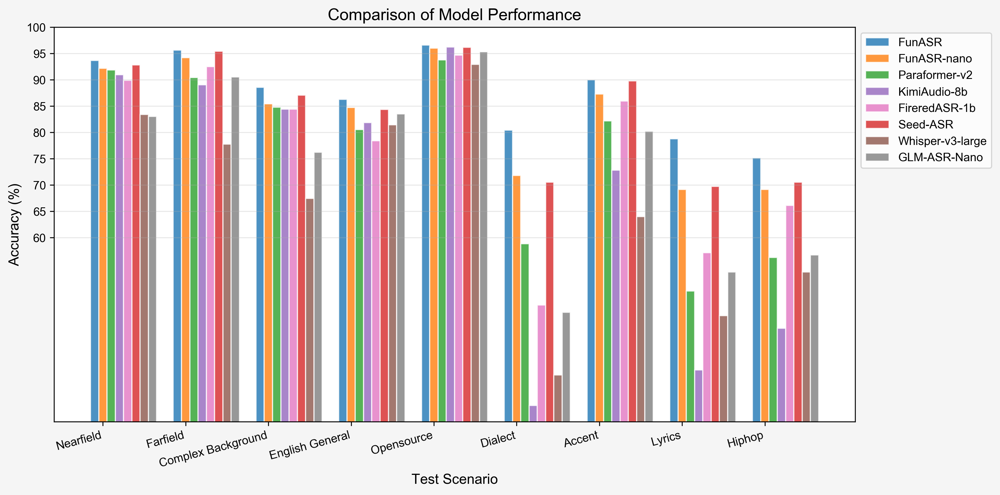

# Fun-ASR

「[简体中文](README_zh.md)」|「English」|「[日本語](README_ja.md)」|「[한국어](README_ko.md)」

Fun-ASR is a family of end-to-end speech recognition models from Tongyi Lab. Checkpoint capabilities are distinct: Fun-ASR-Nano-2512 is trained on tens of millions of hours of speech and supports Chinese, English, Japanese, and Chinese dialects and accents; Fun-ASR-MLT-Nano-2512 is an 800M multilingual checkpoint trained on hundreds of thousands of hours and supports 31 languages. Both checkpoints integrate with FunASR for inference and serving.

<div align="center">

</div>

<div align="center">
<h4>
<a href="https://www.funasr.com/en/"> Homepage </a>
｜<a href="#core-features"> Core Features </a>
｜<a href="#performance-evaluation"> Performance Evaluation </a>
｜<a href="#environment-setup"> Environment Setup </a>
｜<a href="#usage-tutorial"> Usage Tutorial </a>

</h4>

Model repositories: **Fun-ASR-Nano** ([ModelScope](https://www.modelscope.cn/models/FunAudioLLM/Fun-ASR-Nano-2512), [HF / Transformers](https://huggingface.co/FunAudioLLM/Fun-ASR-Nano-2512-hf) · [HF / FunASR](https://huggingface.co/FunAudioLLM/Fun-ASR-Nano-2512)) · **Fun-ASR-MLT-Nano** ([ModelScope](https://www.modelscope.cn/models/FunAudioLLM/Fun-ASR-MLT-Nano-2512), [Hugging Face](https://huggingface.co/FunAudioLLM/Fun-ASR-MLT-Nano-2512))

Online Experience:
[ModelScope Community Space](https://modelscope.cn/studios/FunAudioLLM/Fun-ASR-Nano), [huggingface space](https://huggingface.co/spaces/FunAudioLLM/Fun-ASR-Nano)

[](https://colab.research.google.com/github/QwenAudio/Fun-ASR/blob/main/examples/colab/fun_asr_nano_transformers.ipynb)

[Runnable examples](examples/README.md) cover quickstart inference, direct inference, speaker diarization, vLLM batch inference, and the streaming SDK.

</div>

|                                                                           Model Name                                                                            |                                                                                                                                                                                                       Task Details                                                                                                                                                                                                       |         Training Data          | Parameters |
| :-------------------------------------------------------------------------------------------------------------------------------------------------------------: | :----------------------------------------------------------------------------------------------------------------------------------------------------------------------------------------------------------------------------------------------------------------------------------------------------------------------------------------------------------------------------------------------------------------------: | :----------------------------: | :--------: |
|       Fun-ASR-Nano <br> ([⭐](https://www.modelscope.cn/models/FunAudioLLM/Fun-ASR-Nano-2512) [HF / Transformers](https://huggingface.co/FunAudioLLM/Fun-ASR-Nano-2512-hf) · [HF / FunASR](https://huggingface.co/FunAudioLLM/Fun-ASR-Nano-2512))       | Speech recognition supports Chinese, English, and Japanese. Chinese includes support for 7 dialects (Wu, Cantonese, Min, Hakka, Gan, Xiang, Jin) and 26 regional accents (Henan, Shanxi, Hubei, Sichuan, Chongqing, Yunnan, Guizhou, Guangdong, Guangxi and more than 20 other regions). English and Japanese cover multiple regional accents. Additional features include lyric recognition and rap speech recognition. |   Tens of millions of hours    |    800M    |
| Fun-ASR-MLT-Nano <br> ([⭐](https://www.modelscope.cn/models/FunAudioLLM/Fun-ASR-MLT-Nano-2512) [🤗](https://huggingface.co/FunAudioLLM/Fun-ASR-MLT-Nano-2512)) | Speech recognition supports Chinese, English, Cantonese, Japanese, Korean, Vietnamese, Indonesian, Thai, Malay, Filipino, Arabic, Hindi, Bulgarian, Croatian, Czech, Danish, Dutch, Estonian, Finnish, Greek, Hungarian, Irish, Latvian, Lithuanian, Maltese, Polish, Portuguese, Romanian, Slovak, Slovenian, and Swedish: 31 languages in total. | Hundreds of thousands of hours |    800M    |

<a name="What's News"></a>

# What's New 🔥

- **FunASR 1.4.15** is the current Python release for source installs, MOSS discovery, and realtime or industrial deployment. Install with `python -m pip install -U "funasr==1.4.15"`. [Release ->](https://github.com/modelscope/FunASR/releases/tag/v1.4.15)
- **MOSS-Transcribe-Diarize** is a third-party OpenMOSS model for offline long-form transcription, timestamps, and anonymous speaker labels, with FunASR service, Docker, Kubernetes, vLLM, SGLang, LocalAI, and FunClip deployment paths. [Deploy MOSS ->](https://www.funasr.com/deploy/moss-transcribe-diarize.html)
- **Production deployment** covers realtime WebSocket serving, native vLLM batch/streaming paths, and verified llama.cpp / GGUF packages for Linux, macOS, and Windows. [Runtime v0.2.6 ->](https://github.com/modelscope/FunASR/releases/tag/runtime-llamacpp-v0.2.6) · [vLLM guide ->](docs/vllm_guide.md)

# Native Transformers quickstart

Transcribe with the released Transformers 5.17.0 package. No toolkit installation or remote Python code is needed. Base Nano supports Chinese, English and Japanese; the 31-language MLT checkpoint is separate.

```bash
python -m pip install 'transformers==5.17.0' 'torch==2.10.0' 'torchaudio==2.10.0' 'librosa==0.11.0' 'soundfile==0.13.1'
```

[Full Python recipe](https://www.funasr.com/en/docs/native-transformers.html) · [Local audio, batches and keywords](examples/transformers/) · [Notebook](examples/colab/fun_asr_nano_transformers.ipynb) · [Space](https://huggingface.co/spaces/FunAudioLLM/Fun-ASR-Nano)

```python
import torch
from transformers import AutoModelForSpeechSeq2Seq, AutoProcessor

torch.set_num_threads(4)
model_id = "FunAudioLLM/Fun-ASR-Nano-2512-hf"
revision = "d93b302ee7fd505e1b3576120fc142fc6f7820e1"
audio = "https://huggingface.co/FunAudioLLM/Fun-ASR-Nano-2512/resolve/272c57b82523ada6fd87095e955f8e29100979ab/example/en.mp3"

processor = AutoProcessor.from_pretrained(
    model_id, revision=revision, trust_remote_code=False, token=False
)
model = AutoModelForSpeechSeq2Seq.from_pretrained(
    model_id, revision=revision, trust_remote_code=False, token=False,
    dtype=torch.float32,
).to("cpu").eval()
inputs = processor.apply_transcription_request(
    audio=audio, language="en",
    processor_kwargs={
        "return_tensors": "pt",
        "audio_kwargs": {"sampling_rate": 16000},
        "text_kwargs": {"padding": True},
    },
)
with torch.inference_mode():
    generated = model.generate(**inputs, max_new_tokens=128, do_sample=False)
new_tokens = generated[:, inputs.input_ids.shape[1]:]
print(processor.batch_decode(new_tokens, skip_special_tokens=True)[0])
```

# Core Features 🎯

**Fun-ASR** focuses on high-precision speech recognition, checkpoint-specific multilingual support, and industry customization capabilities.

- **Far-field High-noise Recognition:** Deeply optimized for far-distance sound pickup and high-noise scenarios (such as conference rooms, in-vehicle environments, industrial sites, etc.), improving recognition accuracy to **93%**.
- **Chinese Dialects and Regional Accents:**
  - Supports **7 major dialects**: Wu, Cantonese, Min, Hakka, Gan, Xiang, Jin
  - Covers **26 regional accents**: including Henan, Shaanxi, Hubei, Sichuan, Chongqing, Yunnan, Guizhou, Guangdong, Guangxi and more than 20 other regions
- **Checkpoint-specific language coverage:** Fun-ASR-Nano supports Chinese, English, Japanese, and Chinese dialects and accents. Fun-ASR-MLT-Nano supports **31 languages**, with emphasis on East and Southeast Asian languages.
- **Music Background Lyric Recognition:** Enhanced speech recognition performance under music background interference, supporting accurate recognition of lyric content in songs.

# Environment Setup 🐍

```shell
git clone https://github.com/QwenAudio/Fun-ASR.git
cd Fun-ASR
pip install -r requirements.txt
```

<a name="usage-tutorial"></a>

# Capability boundaries

- [x] Checkpoint-native character timestamps (hub-specific checkpoint state)
  > The current ModelScope `FunAudioLLM/Fun-ASR-Nano-2512` checkpoint includes all 86 trained `ctc_decoder.*` / `ctc.*` tensors (`model.pt` SHA-256 `81fec8616083c69377f3ceef36aba3655660ee0ca69a5d4a1e9810cd340ca499`) and produces native CTC timestamps. The Hugging Face checkpoint at revision `272c57b82523ada6fd87095e955f8e29100979ab` is still the older text-only artifact (`model.pt` SHA-256 `55ae0d2fee369f0f11cce0795f6927934ad17cf11b278a7e56a51272074160bb`) with no CTC tensors. When this repository's current `model.py` is used with `funasr>=1.3.26`, incomplete checkpoints fail closed: transcription remains available, but `timestamps` are omitted instead of returning random 60 ms alignments. Use `hub="ms"` for checkpoint-native timestamps until the Hugging Face artifact and remote code are synchronized. See [issue #70](https://github.com/QwenAudio/Fun-ASR/issues/70) and [FunASR #3496](https://github.com/modelscope/FunASR/issues/3496).
- [ ] Checkpoint-native speaker diarization
  > Fun-ASR-Nano and Fun-ASR-MLT-Nano do not emit speaker labels by themselves. Compose them in FunASR with the separate `fsmn-vad` and `cam++` models, as shown below.
  > For one-pass anonymous diarization with transcription and timestamps, use the third-party OpenMOSS [MOSS-Transcribe-Diarize deployment guide](https://www.funasr.com/deploy/moss-transcribe-diarize.html). It is a separate model rather than a Fun-ASR-Nano checkpoint feature.
- [x] Model training

# Usage 🛠️

## Inference

### Run on CPU / edge — llama.cpp / GGUF (no GPU, no Python)

Run Fun-ASR-Nano as a **single self-contained binary** — like [whisper.cpp](https://github.com/ggml-org/whisper.cpp) but for FunASR, with strong Chinese accuracy. Built-in FSMN-VAD, no Python at runtime.

```bash
bash runtime/llama.cpp/download-funasr-model.sh nano ./gguf
llama-funasr-cli --enc ./gguf/funasr-encoder-f16.gguf -m ./gguf/qwen3-0.6b-q8_0.gguf -a audio.wav --vad ./gguf/fsmn-vad.gguf
```

`fsmn-vad.gguf` is hosted in the shared [FunAudioLLM/fsmn-vad-GGUF](https://huggingface.co/FunAudioLLM/fsmn-vad-GGUF) repo, not inside the Nano GGUF repo. The `nano` downloader above fetches it automatically; to fetch only VAD from the Hugging Face UI/CLI, use:

```bash
hf download FunAudioLLM/fsmn-vad-GGUF --include "*.gguf" --local-dir ./gguf
```

**Prebuilt binaries:** [Releases](https://github.com/QwenAudio/Fun-ASR/releases) · **Download & quickstart:** [funasr.com/llama-cpp](https://www.funasr.com/llama-cpp.html) · **GGUF:** [Nano encoder/LLM](https://huggingface.co/FunAudioLLM/Fun-ASR-Nano-GGUF) · [FSMN-VAD](https://huggingface.co/FunAudioLLM/fsmn-vad-GGUF) · **Docs & benchmarks:** [runtime/llama.cpp/](./runtime/llama.cpp/)

### Using funasr for inference

```python
from funasr import AutoModel


def main():
    model_dir = "FunAudioLLM/Fun-ASR-Nano-2512"
    model = AutoModel(
        model=model_dir,
        trust_remote_code=True,
        remote_code="./model.py",
        device="cuda:0",
        # hub：download models from ms (for ModelScope) or hf (for Hugging Face).
        hub="hf"
    )

    wav_path = f"{model.model_path}/example/zh.mp3"
    res = model.generate(
        input=[wav_path],
        cache={},
        batch_size=1,
        hotwords=["开放时间"],
        # 中文、英文、日文 for Fun-ASR-Nano-2512
        # 中文、英文、粤语、日文、韩文、越南语、印尼语、泰语、马来语、菲律宾语、阿拉伯语、
        # 印地语、保加利亚语、克罗地亚语、捷克语、丹麦语、荷兰语、爱沙尼亚语、芬兰语、希腊语、
        # 匈牙利语、爱尔兰语、拉脱维亚语、立陶宛语、马耳他语、波兰语、葡萄牙语、罗马尼亚语、
        # 斯洛伐克语、斯洛文尼亚语、瑞典语 for Fun-ASR-MLT-Nano-2512
        language="中文",
        itn=True, # or False
    )
    text = res[0]["text"]
    print(text)

    model = AutoModel(
        model=model_dir,
        trust_remote_code=True,
        vad_model="fsmn-vad",
        vad_kwargs={"max_single_segment_time": 30000},
        remote_code="./model.py",
        device="cuda:0",
    )
    res = model.generate(input=[wav_path], cache={}, batch_size=1)
    text = res[0]["text"]
    print(text)


if __name__ == "__main__":
    main()
```

### Faster batch transcription (no vLLM)

When transcribing long audio or many files on the `funasr` (PyTorch) path, pass
`batch_size_s` to batch the VAD segments through the LLM decoder together. This
greatly improves GPU utilization:

```python
res = model.generate(
    input=[wav_path],
    cache={},
    language="中文",
    itn=True,
    batch_size_s=120,   # batch VAD segments up to ~120s of audio per LLM call
)
```

On Fun-ASR-Nano-2512 (184 Chinese files / 11,539 s, single H100) this is about
**1.6x faster** than the default per-segment decoding (RTFx 19.8 -> 31.8) with no
loss in accuracy. For the highest throughput, use the vLLM path below.

### Speaker Diarization

This example is a composed FunASR pipeline: FSMN-VAD segments the audio,
Fun-ASR-Nano transcribes it, CAM++ assigns speaker labels, and CT-Punc restores
punctuation. The `start` and `end` values are VAD segment boundaries, not
reliable checkpoint-native character timestamps.

```python
from funasr import AutoModel


def main():
    model_dir = "FunAudioLLM/Fun-ASR-Nano-2512"
    model = AutoModel(
        model=model_dir,
        trust_remote_code=True,
        remote_code="./model.py",
        vad_model="fsmn-vad",
        vad_kwargs={"max_single_segment_time": 30000},
        spk_model="cam++",
        punc_model="ct-punc",
        device="cuda:0",
        hub="hf",
    )

    wav_path = f"{model.model_path}/example/zh.mp3"
    res = model.generate(input=[wav_path], cache={}, batch_size=1, language="中文")

    # Per-sentence results with speaker labels
    for sent in res[0]["sentence_info"]:
        print(f"Speaker {sent['spk']}: [{sent['start']}ms - {sent['end']}ms] {sent['sentence']}")


if __name__ == "__main__":
    main()
```

### Direct Inference

```python
from model import FunASRNano


def main():
    model_dir = "FunAudioLLM/Fun-ASR-Nano-2512"
    m, kwargs = FunASRNano.from_pretrained(model=model_dir, device="cuda:0")
    m.eval()

    wav_path = f"{kwargs['model_path']}/example/zh.mp3"
    res = m.inference(data_in=[wav_path], **kwargs)
    text = res[0][0]["text"]
    print(text)


if __name__ == "__main__":
    main()
```

<details><summary> Parameter Description (click to expand) </summary>

- `model_dir`: Model name or local disk model path.
- `trust_remote_code`: Whether to trust remote code for loading custom model implementations.
- `remote_code`: Specify the location of specific model code (e.g., `model.py` in the current directory), supporting both absolute and relative paths.
- `device`: Specify the device to use, such as "cuda:0" or "cpu".

</details>


# vLLM High-Throughput Inference 🚀

Fun-ASR natively integrates the [vLLM](https://github.com/vllm-project/vllm) engine for high-throughput batch inference and production-grade real-time streaming service.

> Full guide: [docs/vllm_guide.md](docs/vllm_guide.md) | API docs: [modelscope.github.io/FunASR/vllm.html](https://modelscope.github.io/FunASR/vllm.html)

### Three Modes

| Mode | Use Case | Entry |
|------|----------|-------|
| **Offline Batch** | Large-scale transcription | `AutoModelVLLM` |
| **Streaming SDK** | Real-time subtitles | `FunASRNanoStreamingVLLM` |
| **WebSocket Service** | Production deployment | `serve_realtime_ws.py` |

### Offline Batch Inference (3-5x faster)

```python
from funasr.auto.auto_model_vllm import AutoModelVLLM

model = AutoModelVLLM(
    model="FunAudioLLM/Fun-ASR-Nano-2512",
    tensor_parallel_size=2,      # Multi-GPU
    gpu_memory_utilization=0.8,
)

results = model.generate(
    ["audio1.wav", "audio2.wav", "audio3.wav"],
    language="中文",
    hotwords=["张三", "北京"],
)
for r in results:
    print(f"[{r['key']}] {r['text']}")
```

> **Long audio:** `AutoModelVLLM` decodes each input in a single pass, so a long
> recording (e.g. a multi-minute meeting) can be truncated — pre-segment it with
> VAD and pass the segments, or use the high-level
> `AutoModel(model=..., vad_model="fsmn-vad")`, which segments long audio
> automatically.

### Real-time WebSocket Service

```bash
# Start server (with dynamic VAD + speaker diarization)
python serve_realtime_ws.py --port 10095 --language 中文 --tensor-parallel-size 2

# Browser client
open client_mic.html

# Python client
python client_python.py --server ws://localhost:10095 --mic
```

**WebSocket Protocol:**
```
Client: "START" → Server: {"event":"started"}
Client: [audio bytes] → Server: {"sentences":[...], "partial":"..."}
Client: "STOP" → Server: {"sentences":[...], "is_final":true}
```

### Streaming SDK

```python
from funasr.models.fun_asr_nano.inference_vllm_streaming import FunASRNanoStreamingVLLM

engine = FunASRNanoStreamingVLLM.from_pretrained(
    model="FunAudioLLM/Fun-ASR-Nano-2512", chunk_ms=720
)

for result in engine.streaming_generate("audio.wav", language="中文"):
    print(f"[{result['audio_duration_ms']:.0f}ms] {result['fixed_text']}")
```

### Performance

| Method | Time (184 files, 11,541s) | RTFx | CER |
|--------|---------------------|------|-----|
| PyTorch native | 550s | 21x | 8.06% |
| **vLLM (ours)** | **34s** | **340x** | **8.20%** |

> **16x faster** than PyTorch with nearly identical accuracy (CER diff < 0.2%)

### Install

```bash
pip install "funasr>=1.3.26" "vllm>=0.12.0"
```

# Finetune

Please refer to [docs/finetune.md](docs/finetune.md)

# Performance 📝

We evaluated Fun-ASR against other state-of-the-art models on open-source benchmarks, Chinese dialect datasets, and industry-specific test sets. The results demonstrate that Fun-ASR achieves superior performance across various scenarios.

### 1. Open-Source Dataset Performance (WER %)

| Test set            | GLM-ASR-nano | GLM-ASR-nano\* | Whisper-large-v3 | Seed-ASR | Seed-ASR\* | Kimi-Audio | Step-Audio2 | FireRed-ASR | Fun-ASR-nano | Fun-ASR |
| :------------------ | :----------: | :------------: | :--------------: | :------: | :--------: | :--------: | :---------: | :---------: | :----------: | :-----: |
| **Model Size**      |     1.5B     |      1.5B      |       1.6B       |    -     |     -      |     -      |      -      |    1.1B     |     0.8B     |  7.7B   |
| **OpenSource**      |      ✅      |       ✅       |        ✅        |    ❌    |     ❌     |     ✅     |     ✅      |     ✅      |      ✅      |   ❌    |
| AIShell1            |     1.81     |      2.17      |       4.72       |   0.68   |    1.63    |    0.71    |    0.63     |    0.54     |     1.80     |  1.22   |
| AIShell2            |      -       |      3.47      |       4.68       |   2.27   |    2.76    |    2.86    |    2.10     |    2.58     |     2.75     |  2.39   |
| Fleurs-zh           |      -       |      3.65      |       5.18       |   3.43   |    3.23    |    3.11    |    2.68     |    4.81     |     2.56     |  2.53   |
| Fleurs-en           |     5.78     |      6.95      |       6.23       |   9.39   |    9.39    |    6.99    |    3.03     |    10.79    |     5.96     |  4.74   |
| Librispeech-clean   |     2.00     |      2.17      |       1.86       |   1.58   |    2.8     |    1.32    |    1.17     |    1.84     |     1.76     |  1.51   |
| Librispeech-other   |     4.19     |      4.43      |       3.43       |   2.84   |    5.69    |    2.63    |    2.42     |    4.52     |     4.33     |  3.03   |
| WenetSpeech Meeting |     6.73     |      8.21      |      18.39       |   5.69   |    7.07    |    6.24    |    4.75     |    4.95     |     6.60     |  6.17   |
| WenetSpeech Net     |      -       |      6.33      |      11.89       |   4.66   |    4.84    |    6.45    |    4.67     |    4.94     |     6.01     |  5.46   |

> _Note: Seed-ASR\* results are evaluated using the official API on volcengine; GLM-ASR-nano\* results are evaluated using the open-source checkpoint._

### 2. Industry Dataset Performance (WER %)

| Test set           | GLM-ASR-Nano | Whisper-large-v3 | Seed-ASR  | FireRed-ASR | Kimi-Audio | Paraformer v2 | Fun-ASR-nano |  Fun-ASR  |
| :----------------- | :----------: | :--------------: | :-------: | :---------: | :--------: | :-----------: | :----------: | :-------: |
| **Model Size**     |     1.5B     |       1.6B       |     -     |    1.1B     |     8B     |     0.2B      |     0.8B     |   7.7B    |
| **OpenSource**     |      ✅      |        ✅        |    ❌     |     ✅      |     ✅     |      ✅       |      ✅      |    ❌     |
| Nearfield          |    16.95     |      16.58       |   7.20    |    10.10    |    9.02    |     8.11      |     7.79     |   6.31    |
| Farfield           |     9.44     |      22.21       |   4.59    |    7.49     |   10.95    |     9.55      |     5.79     |   4.34    |
| Complex Background |    23.79     |      32.57       |   12.90   |    15.56    |   15.56    |     15.19     |    14.59     |   11.45   |
| English General    |    16.47     |      18.56       |   15.65   |    21.62    |   18.12    |     19.48     |    15.28     |   13.73   |
| Opensource         |     4.67     |       7.05       |   3.83    |    5.31     |    3.79    |     6.23      |     4.22     |   3.38    |
| Dialect            |    54.21     |      66.14       |   29.45   |    52.82    |   71.94    |     41.16     |    28.18     |   15.21   |
| Accent             |    19.78     |      36.03       |   10.23   |    14.05    |   27.20    |     17.80     |    12.90     |   10.31   |
| Lyrics             |    46.56     |      54.82       |   30.26   |    42.87    |   65.18    |     50.14     |    30.85     |   21.00   |
| Hiphop             |    43.32     |      46.56       |   29.46   |    33.88    |   57.25    |     43.79     |    30.87     |   28.58   |
| **Average**        |  **26.13**   |    **33.39**     | **15.95** |  **22.63**  | **31.00**  |   **23.49**   |  **16.72**   | **12.70** |

<div align="center">

</div>

## Remarkable Third-Party Work

- **[Fun-ASR-vllm](https://github.com/yuekaizhang/Fun-ASR-vllm)** ([@yuekaizhang](https://github.com/yuekaizhang)) — a community vLLM implementation of Fun-ASR (~50% speedup over PyTorch), with batch inference and an NVIDIA Triton Inference Server integration for high-concurrency production deployment. See [#34](https://github.com/QwenAudio/Fun-ASR/issues/34).

> Native vLLM support is also built in — see [vLLM High-Throughput Inference 🚀](#vllm-high-throughput-inference-) above for the `AutoModelVLLM` batch engine, the streaming SDK, and the WebSocket service.

## Ecosystem

Fun-ASR-Nano is part of the **FunAudioLLM** family:

| Project | Description | Stars |
|---------|-------------|-------|
| [FunASR](https://github.com/modelscope/FunASR) | Industrial speech recognition toolkit — VAD, ASR, punctuation, diarization | [](https://github.com/modelscope/FunASR) |
| [SenseVoice](https://github.com/QwenAudio/SenseVoice) | Multilingual speech understanding — ASR + emotion + audio events | [](https://github.com/QwenAudio/SenseVoice) |
| [CosyVoice](https://github.com/QwenAudio/CosyVoice) | Natural speech generation — multi-language, zero-shot cloning | [](https://github.com/QwenAudio/CosyVoice) |
| [FunClip](https://github.com/modelscope/FunClip) | AI-powered video clipping with speech recognition | [](https://github.com/modelscope/FunClip) |

<a href="https://star-history.com/#QwenAudio/Fun-ASR&modelscope/FunASR&QwenAudio/SenseVoice&Date">
  <picture>
    <source media="(prefers-color-scheme: dark)" srcset="https://api.star-history.com/svg?repos=QwenAudio/Fun-ASR,modelscope/FunASR,QwenAudio/SenseVoice&type=Date&theme=dark" />
    <source media="(prefers-color-scheme: light)" srcset="https://api.star-history.com/svg?repos=QwenAudio/Fun-ASR,modelscope/FunASR,QwenAudio/SenseVoice&type=Date" />
    
  </picture>
</a>

## License

- Source code in this repository is licensed under the [Apache License 2.0](./LICENSE).
- Model weights are distributed separately and follow the license metadata on their model cards. The official [Fun-ASR-Nano](https://huggingface.co/FunAudioLLM/Fun-ASR-Nano-2512) and [Fun-ASR-MLT-Nano](https://huggingface.co/FunAudioLLM/Fun-ASR-MLT-Nano-2512) cards currently list Apache-2.0; review the card for the specific artifact you download.

## Citations

```bibtex
@misc{an2025funasrtechnicalreport,
      title={Fun-ASR Technical Report},
      author={Keyu An and Yanni Chen and Zhigao Chen and Chong Deng and Zhihao Du and Changfeng Gao and Zhifu Gao and Bo Gong and Xiangang Li and Yabin Li and Ying Liu and Xiang Lv and Yunjie Ji and Yiheng Jiang and Bin Ma and Haoneng Luo and Chongjia Ni and Zexu Pan and Yiping Peng and Zhendong Peng and Peiyao Wang and Hao Wang and Haoxu Wang and Wen Wang and Wupeng Wang and Yuzhong Wu and Biao Tian and Zhentao Tan and Nan Yang and Bin Yuan and Jieping Ye and Jixing Yu and Qinglin Zhang and Kun Zou and Han Zhao and Shengkui Zhao and Jingren Zhou and Yanqiao Zhu},
      year={2025},
      eprint={2509.12508},
      archivePrefix={arXiv},
      primaryClass={cs.CL},
      url={https://arxiv.org/abs/2509.12508},
}
```
